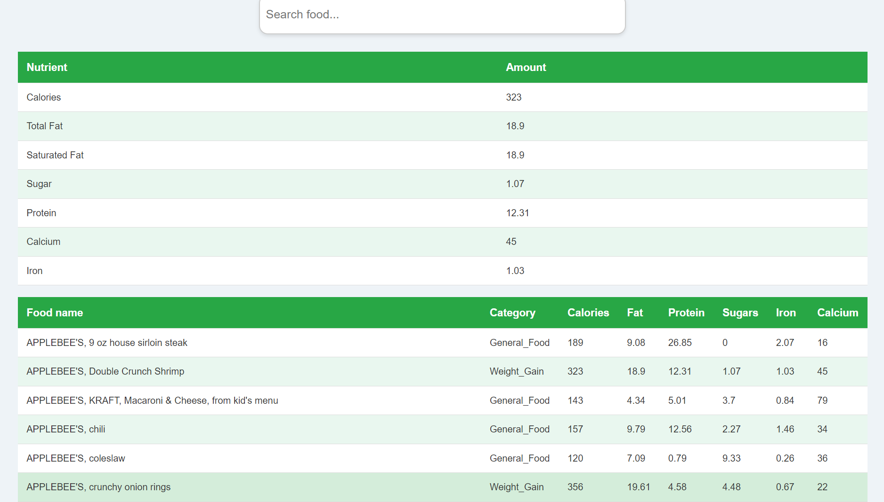

# 🥗 Food/Diet Recommendation System

An intelligent and interactive web-based application that provides **personalized food recommendations** using machine learning and nutrient-based filters. Ideal for users with goals like **muscle gain**, **weight gain**, **weight loss**, or general healthy eating.

Built with **Flask**, **Python**, and a clean visual UI.

---

## 📸 Screenshot

---

## 🔍 Features

- 🔬 Predicts dietary goals: **Muscle Gain**, **Weight Gain**, **Weight Loss**
- 🥦 Filters based on:
  - Vegetarian / Non-Vegetarian
  - Iron-rich / Calcium-rich
- 📊 Input macro nutrients: **Calories**, **Protein**, **Fibre**
- 🤖 ML model predicts category and recommends 5 random foods from it
- 📋 Displays filtered food names from CSV-based dataset
- 🖥️ User-friendly interface with background images and styled buttons

---

## 🛠️ Tech Stack

- **Python 3**
- **Flask**
- **Pandas / CSV Data**
- **Scikit-learn (model loading)**
- **HTML + CSS (frontpage UI)**

